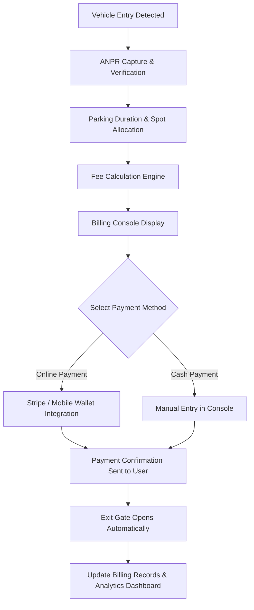
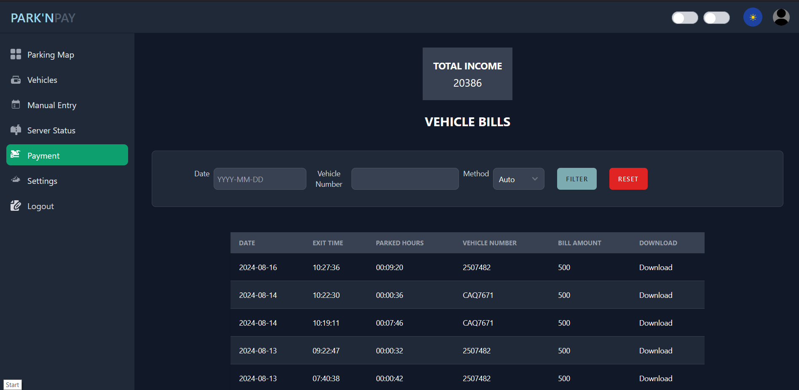

# Billing Console

The **Billing Console** in ParkEase provides administrators and operators with a secure and transparent way to manage financial transactions related to parking usage. It integrates with cloud-based payment gateways and ensures smooth and reliable processing.

---

## 1. Key Features

- **Automated Fee Calculation**  
        - Calculates fees based on entry/exit timestamps captured by the ANPR (Automatic Number Plate Recognition) system.  
        - Supports both **per-hour** and **flat-rate** billing models.  

- **Real-Time Transaction Logs**  
        - Stores each transaction with timestamp, vehicle plate number, and payment status.  
        - Provides an audit trail for financial compliance.  

- **Multiple Payment Methods**  
        - Online payments via credit/debit cards and mobile wallets.  
        - Manual cash payment option for facilities without full automation.  

- **Billing Dashboard**  
        - Displays revenue, pending invoices, and subscription activity.  
        - Offers daily, weekly, and monthly financial insights.  

---

## 2. System Flow

---

## 3. User Interface

  

- **Payment Entry Console:** Operators can view pending payments, mark cash payments, and process online transactions.  
- **Transaction History:** Complete list of paid and pending transactions.  
- **Reports & Analytics:** Overview of revenue, peak hours, and occupancy trends.

---

## 4. Workflow Overview

1. Vehicle entry is captured via **ANPR**.  
2. Parking duration is computed in real-time.  
3. Billing console displays the fee for the vehicle.  
4. User chooses a **payment method**: online or cash.  
5. Upon payment confirmation, **exit gate opens** automatically.  
6. All transactions are logged for reporting and auditing.

---

## 5. Benefits

- **Faster Transactions:** Minimized manual handling of payments.  
- **Enhanced Accuracy:** Reduced human error with automated calculations.  
- **Revenue Tracking:** Real-time insights for parking management.  
- **Seamless Integration:** Works alongside the ParkEase console and edge devices.

