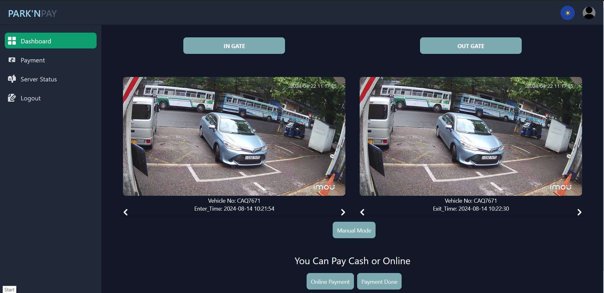
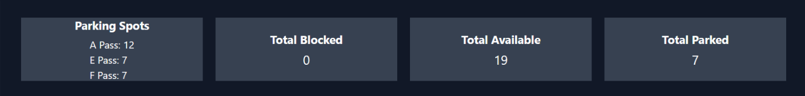

# ParkEase Admin Dashboard

The **ParkEase Admin Dashboard** is the central interface for monitoring, managing, and controlling parking operations in real-time.  
It provides an **intuitive overview** of all critical metrics, gate activity, and parking slot status, enabling operators and administrators to make data-driven decisions efficiently.

---

## 1. Dashboard Overview

Upon login, the dashboard presents a **high-level summary** of the parking facility's operations:

- **Total Vehicles Today** – Number of vehicles that entered the facility  
- **Active Parking Slots** – Real-time availability of parking spaces  
- **Occupancy Rate (%)** – Percentage of currently occupied slots  
- **Revenue Collected** – Total revenue from billing for the day or selected period  
- **Alerts & Notifications** – Emergency alerts, gate malfunctions, or maintenance notices  

  

The dashboard integrates with the **Edge + Cloud architecture**, fetching real-time data from the edge devices (ANPR cameras, sensors) and aggregating it in the cloud.

---

## 2. Dashboard Components

### 2.1 Key Metrics Cards

These cards provide **at-a-glance insights**:

| Metric | Description |
|--------|-------------|
| **Total Vehicles** | Number of vehicles entered or exited today |
| **Available Slots** | Number of free parking slots in real-time |
| **Revenue Collected** | Billing and payment summary for the selected period |
| **Alerts** | Emergency, sensor, or gate alerts requiring attention |

  

### 2.2 Gate Activity Log

Displays **recent vehicle entries and exits**:

- Vehicle license plate  
- Gate number  
- Time of entry/exit  
- Operator action if any manual intervention occurred  

<!-- 

  

 -->

---

## 3. Analytics & Reports

The dashboard allows administrators to **analyze historical data**:

- Daily, weekly, or monthly vehicle counts  
- Slot occupancy trends and peak hours  
- Revenue analysis per gate, floor, or time slot  
- Exportable reports in **CSV or PDF format**  

This provides actionable insights for **optimizing parking utilization** and planning future expansions.

---

## 4. Dashboard Actions

- **View Details** – Click on any metric card to access in-depth reports  
- **Export Reports** – Download logs or billing reports for auditing purposes  
- **Quick Navigation Buttons** – Access Console, Billing, Parking Map, or GUI modules  
- **Alerts Management** – Acknowledge or resolve detected issues from the dashboard  

---

## 5. Security & User Roles

ParkEase supports **role-based access control** to protect sensitive operations:

| Role | Permissions |
|------|------------|
| **Admin** | Full access to all dashboard modules, reports, and settings |
| **Operator** | Access to live dashboard, parking map, and basic analytics |
| **Security Staff** | Monitor gates and receive alerts only, no control over billing or settings |

---

## 6. Real-Time Data Integration

The dashboard is integrated with **edge devices and cloud services**:

- ANPR cameras send vehicle data to the server  
- Edge devices send sensor readings and gate status  
- Cloud backend aggregates data for dashboard visualization  
- Live updates are delivered via **WebSockets or API polling**

---

## 7. Best Practices

- Ensure **stable network connectivity** between edge devices and cloud server  
- Assign proper **roles and permissions** for operators and admins  
- Regularly **monitor alerts** to maintain smooth parking operations  
- Use analytics to **optimize space allocation** and **improve revenue**

---

## 8. Notes

- The dashboard is fully responsive and works on desktops, tablets, and large monitors  
- Visualizations are interactive, enabling operators to **drill down** into data  
- The dashboard serves as the **central control hub** for ParkEase operations

<!-- 

  

 -->
