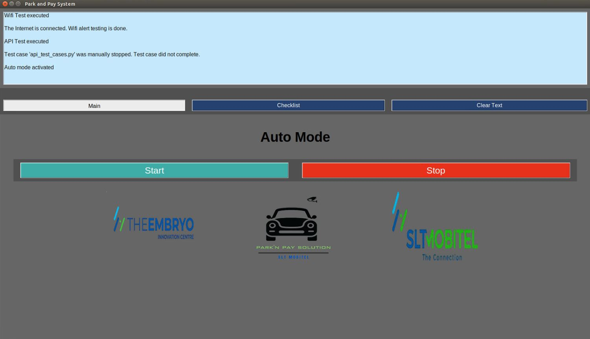
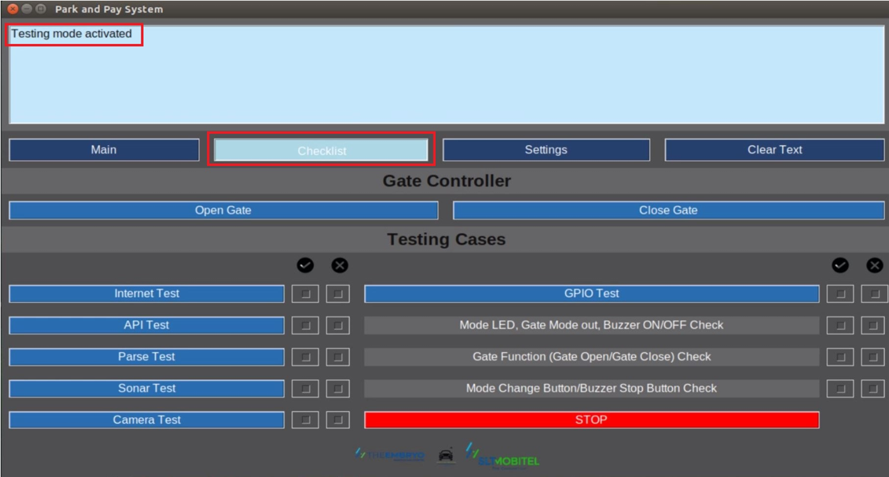
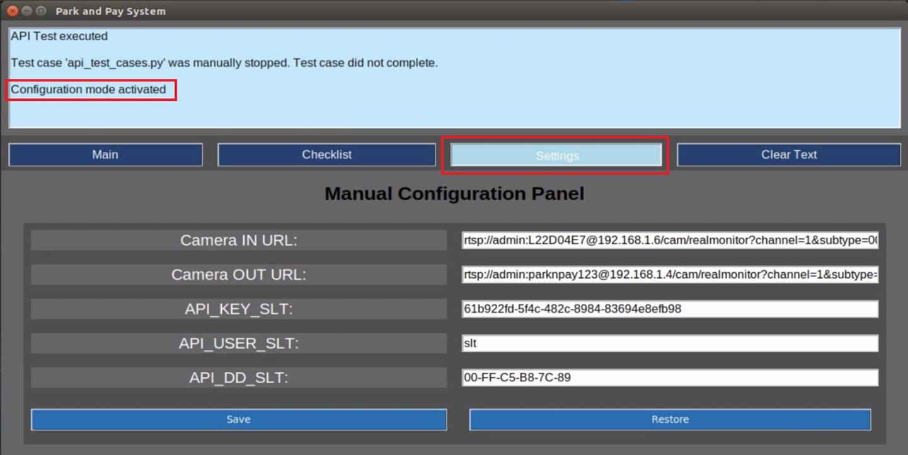

# ParkEase GUI

## 1. Introduction

The **Graphical User Interface (GUI)** of ParkEase simplifies the management of parking operations. It consolidates all background scripts, testing modules, and edge device controls into a single, user-friendly interface.

This GUI allows operators to:

- Run automated processes without using scripts or IDEs.
- Perform manual testing of system components.
- Adjust settings and configurations specific to deployment sites.

---

## 2. GUI Structure

The GUI has **three main frames**:

 - **Auto Mode Frame**  
 - **Testing Mode Frame**  
 - **Settings Mode Frame**

Each frame serves a specific purpose and contains dedicated widgets for operators.

---

### 2.1. Auto Mode Frame

The **Auto Mode Frame** manages the core ParkEase automation functions. It controls the entry/exit process via ANPR, spot allocation, and gate operations.

**Widgets:**

- **Mini Display:** Shows output statements from scripts and processes.  
- **Main Button:** Switches to Auto Mode.  
- **Checklist Button:** Switches to Testing Mode.  
- **Clear Text Button:** Clears mini display and resets checkboxes.  
- **Start Button:** Initiates automated parking process (`main.py`).  
- **Stop Button:** Stops ongoing automation.  
- **Logo Display:** Shows company logo and developers.

  

---

### 2.2. Testing Mode Frame

The **Testing Mode Frame** allows operators to run individual system tests manually.

**Testing Buttons:**

- Open Gate / Close Gate – Emergency gate control  
- Internet Test – Checks WiFi connectivity  
- API Test – Validates API responsiveness  
- Parse Test – Tests LED panel functionality  
- Sensor Test – Tests sonar sensor  
- GPIO Test – Tests Jetson Nano pins  

**Checkbox Indicators:**

- Buzzer Start / Stop – Confirms buzzer operation  
- Mode Change – Confirms mode switch functionality  
- STOP – Immediately stops any running test  

  

**Pop-Up Windows:** Used for user confirmations during API, camera, sonar, or GPIO tests.

---

### 2.3. Settings Mode Frame

The **Settings Mode Frame** allows configuration of parameters that vary by deployment location. All changes are saved in a configuration file used by the system.

**Widgets:**

- Input Fields – Modify key variables for system operation  
- Save Button – Applies and saves changes  
- Restore Button – Loads default values  

  

**Notes:**

- Default values can be restored but cannot be changed directly through the GUI.  
- Notifications appear on the mini display whenever settings are saved or restored.

---

## 3. Benefits of the GUI

- **Simplified Operation:** No need to manually run scripts.  
- **Enhanced Testing:** Manual and automated modes help ensure reliability.  
- **Customizable:** Adjust settings for different parking locations.  
- **Centralized Control:** All system functions accessible from one interface.

