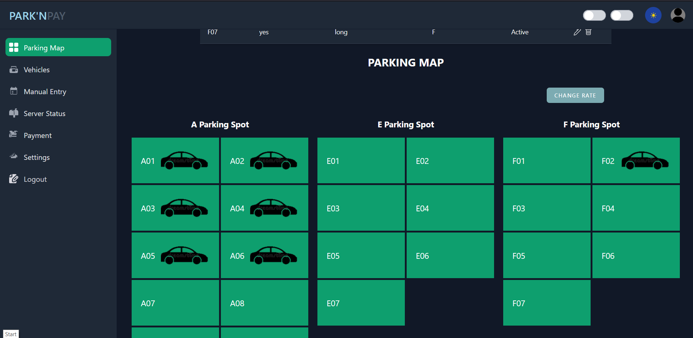
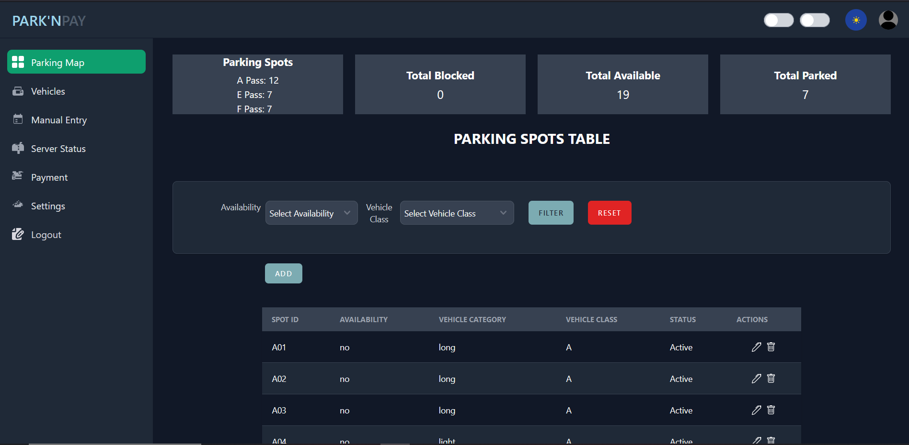

# Parking Map Console

The **Parking Map Console** provides a **real-time visual representation** of the parking facility layout.  
It is designed for operators, administrators, and security teams to **monitor and manage parking slots** with accuracy and efficiency.

  

---

## 1. Key Features

### 1.1 Real-Time Slot Monitoring
- Instant updates from edge devices (sensors, cameras).  
- Color-coded slots for easy recognition.  
- Tooltip on hover displays **slot ID, status, last updated time**.

### 1.2 Interactive Controls
- **Zoom & Pan** → Navigate large parking facilities.  
- **Click on Slot** → Open slot details, vehicle info, and duration parked.  
- **Search Bar** → Quickly locate a vehicle by license plate or slot number.  

### 1.3 Reserved Slot Management
- Allocate reserved slots for **VIPs, staff, or handicapped drivers**.  
- Prevent unauthorized usage with automatic alerts.  

---

## 2. Slot Details Panel

When clicking a slot on the map, a details panel appears with the following:

- Slot ID & Zone (e.g., B2-15)  
- Current Status (Available, Occupied, Reserved, Disabled)  
- Vehicle Details (License plate, entry time, duration parked)  
- Charging Status (if applicable)  
- Manual Override option (Admin/Operator only)  

  

---

## 3. Integration with Dashboard

The Parking Map Console works closely with the **Admin Dashboard**:

- Occupancy metrics are synced and reflected in **dashboard statistics**.  
- Clicking "View Parking Map" from dashboard redirects to this module.  
- Alerts raised here (e.g., unauthorized parking) are logged in the dashboard's **alerts panel**.  

---

## 4. Operator Actions

Operators can perform the following actions directly from the Parking Map:

- **Assign Slot** → Reserve a slot for a vehicle in advance.  
- **Free Slot** → Mark a slot as available after manual intervention.  
- **Send Alert** → Flag a vehicle for investigation (e.g., overstaying or incorrect slot).  
- **Lock/Unlock Gate** (if connected to slot region).  

---

## 5. User Roles & Permissions

| Role | Permissions |
|------|-------------|
| **Admin** | Full control: edit layout, override slots, generate reports |
| **Operator** | Monitor live slots, assign/release slots, acknowledge alerts |
| **Security Staff** | View-only access for monitoring unauthorized vehicles |

---

## 6. Best Practices

- Keep **map layouts updated** to reflect physical changes in the facility.  
- Regularly review **slot utilization analytics** to optimize space.  
- Configure **alerts for overstays** and unauthorized slot use.  
- Train operators to use **manual override responsibly**.  

