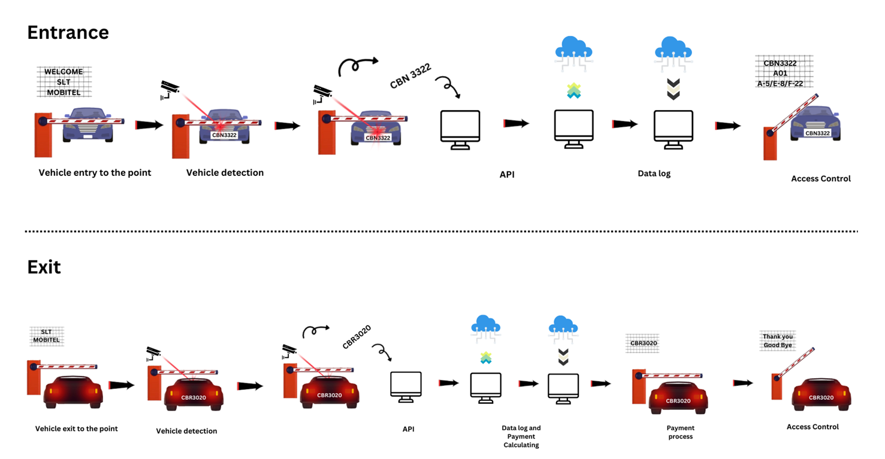

# Overview

## Introduction

**ParkEase** is an **AI & Cloud-powered parking management platform** developed by **SLTMobitel Innovation Center – The Embryo**.  
It is designed to address the growing challenges of urban mobility, parking congestion, and inefficient car park management by leveraging:

- **Artificial Intelligence (AI)**
- **Internet of Things (IoT)**
- **Cloud Computing**

---

## Why ParkEase?

Traditional parking management systems are limited, often relying on manual checks, tokens, or outdated sensors.  
**ParkEase modernizes parking operations** by providing:

- **Seamless Vehicle Access** using **ANPR (Automatic Number Plate Recognition)**  
- **Real-time Parking Visibility** with live parking maps  
- **Faster Operations** through **edge computing** at entry/exit points  
- **Scalable Cloud Backend** to handle multiple car parks across different locations  
- **Optional Billing & User Accounts** for complete monetization  

---

## System Architecture

ParkEase is built with a **hybrid Edge + Cloud architecture**:

1. **Edge Devices**  
    - ANPR cameras at gates  
    - Local controllers for gate automation  
    - Real-time decision making for entry/exit  

2. **Cloud Services**  
    - Centralized management console  
    - Data storage & analytics  
    - Multi-car park monitoring  
    - Integration APIs  

3. **End User Interfaces**  
    - **Operator Console** for monitoring & control  
    - **Parking Map** for real-time availability  
    - **Billing Module** for payments and account handling  

<!-- *Figure : Basic System Architecture*  -->
---

## Core Capabilities

- :camera: **ANPR & Automated Gates**  
  Vehicles are identified automatically at entry/exit.

- :bar_chart: **Analytics & Reports**  
  Gain insights into usage, occupancy, and revenue trends.

- :globe_with_meridians: **Multi-Site Management**  
  Manage multiple car parks under a single cloud dashboard.

- :lock: **Security & Access Control**  
  Every vehicle event is logged and validated.

- :gear: **Flexible Integration**  
  Works with existing gate barriers, ticketing, or mobile apps.

---

## Benefits

- **Reduced Congestion** → Faster entry/exit flow.  
- **Cost Efficiency** → Lower manpower requirements.  
- **Enhanced User Experience** → Drivers find parking quicker.  
- **Scalability** → From small private lots to large city-wide deployments.  
- **Data-Driven Decisions** → Smart analytics for operators.  

---

## Target Users

- :office: **Corporate Campuses** – employee parking automation  
- :department_store: **Shopping Malls** – customer-friendly parking  
- :hospital: **Hospitals & Universities** – controlled access zones  
- :cityscape: **Smart Cities** – integrated parking across multiple facilities  

---

## Next Steps

👉 Continue to:  
    - [**Getting Started Guide**](getting-started.md)  
    - [**Console Features**](console/dashboard.md)    
