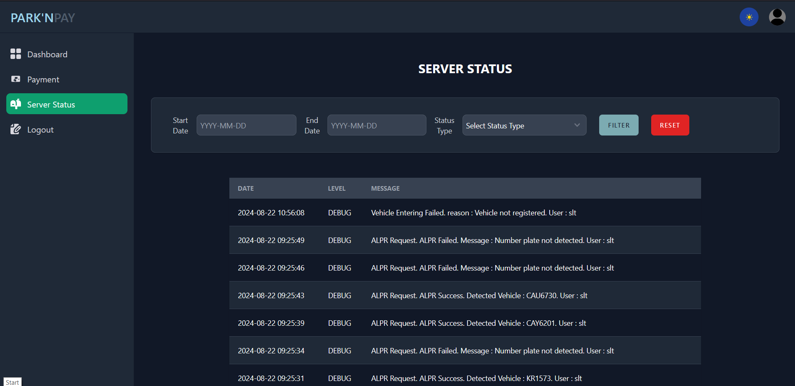

# ParkEase Troubleshooting Guide

This guide provides solutions for common issues that may arise during the operation of the ParkEase system, including hardware, software, and network problems. Follow the steps carefully to maintain smooth operations.

---

## 1. Vehicle Entry Issues

**Problem:** Vehicles are not being recognized or gates do not open.

**Possible Causes & Solutions:**

| Cause | Solution |
|-------|---------|
| ANPR camera misaligned | Reposition camera according to the installation diagram. Ensure clear line of sight. |
| Camera offline / no feed | Check Ethernet cable or WiFi connectivity. Restart camera if needed. |
| Jetson Nano not running | Ensure `main.py` is running on the edge device. Check power supply. |
| Gate actuator malfunction | Test gate manually via **Testing Mode → Open/Close Gate**. |

---

## 2. LED Display Malfunctions

**Problem:** Messages are not displayed or LED panel is unresponsive.

**Steps to Fix:**

1. Check NodeMCU connection and power supply.  
2. Run **Testing Mode → Parse Test** to confirm LED panel responsiveness.  
3. Verify correct GPIO pin assignments on Jetson Nano.  
4. Restart the LED panel software module if needed.

<!-- 

  

 -->

---

## 3. Sensor Errors

**Problem:** Ultrasonic sensors do not detect vehicles correctly.

**Solutions:**

- Confirm correct placement of ultrasonic sensor above the gate area.  
- Run **Testing Mode → Sensor Test** to verify sensor operation.  
- Ensure sensor wires are securely connected to the edge device.  
- Avoid obstruction or environmental interference (rain, dirt, debris).

---

## 4. Network / Connectivity Issues

**Problem:** System cannot connect to the server or cloud console.

**Steps:**

1. Check WiFi/Ethernet connection on Jetson Nano and cameras.  
2. Test internet connectivity using **Testing Mode → Internet Test**.  
3. Ensure firewall or router allows traffic for required ports (HTTP, RTSP).  
4. Reboot edge devices and confirm IP settings are correct.  

---

## 5. GUI & Console Errors

**Problem:** GUI buttons do not respond or mini display shows errors.

**Solutions:**

- Restart the GUI application.  
- Verify all scripts (`main.py`, testing scripts, LED module) are running in the correct directory.  
- Check the configuration file for invalid entries.  
- Run **Testing Mode** to isolate faulty components.

<!-- 

  

 -->

---

## 6. Billing & Payment Issues

**Problem:** Payments fail or are not logged correctly.

**Solutions:**

- Check internet connection for online payment modules (Stripe, mobile wallet).  
- Verify correct configuration in the **Billing Module** console.  
- Ensure the vehicle entry/exit timestamps are correctly recorded.  
- Confirm payment confirmations are being received and recorded in the server database.

---

## 7. Emergency Stop & Gate Control

**Problem:** Gate does not stop in emergency or actuator is unresponsive.

**Steps:**

1. Use the **Testing Mode → STOP** button immediately.  
2. Check buzzer and LED indicators for operational confirmation.  
3. Inspect the gate relay module and wiring.  
4. Verify power supply to the gate controller bypass module.

---

## Tips for Preventive Maintenance

- Regularly clean camera lenses and LED panels.  
- Verify ultrasonic sensors are unobstructed.  
- Keep Jetson Nano and peripherals dust-free.  
- Test all emergency functions weekly.  
- Backup configuration files and database frequently.

---

> For unresolved issues, contact **SLTMobitel Innovation Center – The Embryo** support team through the [Support Page](support.md).
